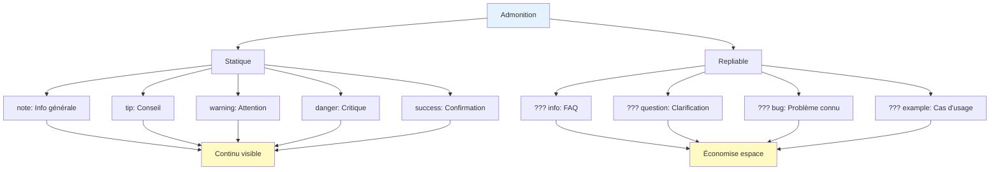

# Admonitions et blocs détail

## Vue d'ensemble

Les admonitions (aussi appelées callouts ou notices) attirent l'attention sur un contenu spécifique. Zensical offre:
- **Admonitions** : Notes, avertissements, conseils (collapsibles optionnels)
- **Blocs détail** : Contenu repliable (expandable/collapsible)
- **Icônes colorées** : Chaque type a sa couleur et son icône
- **Plusieurs types** : note, warning, danger, info, tip, success, question, bug, example

## Syntaxe des admonitions

### Note simple

```markdown
!!! note

    Ceci est une note d'information utile.
```

Rendu:
!!! note

    Ceci est une note d'information utile.

### Admonition avec titre personnalisé

```markdown
!!! warning "⚠️ Attention critique"

    N'ignorez pas cette étape ou vous risquez de casser l'application.
```

Rendu:
!!! warning "⚠️ Attention critique"

    N'ignorez pas cette étape ou vous risquez de casser l'application.

### Types d'admonitions

```markdown
!!! note "Note"
    Information générale utile.

!!! info "Information"
    Détail technique ou contextuel.

!!! tip "Conseil"
    Astuce ou optimisation recommandée.

!!! success "Succès"
    Opération complétée avec succès.

!!! question "Question"
    Point d'interrogation courant ou FAQ.

!!! warning "Avertissement"
    Mise en garde importante.

!!! danger "Danger"
    Contenu critique ou erreur à éviter absolument.

!!! bug "Bug"
    Problème connu ou limita Markdown.

!!! example "Exemple"
    Cas d'usage ou démonstration.
```

## Blocs repliables (Details/Collapsible)

### Syntaxe

Utilisez `???` au lieu de `!!!`:

```markdown
??? info "Cliquez pour ouvrir"

    Contenu caché jusqu'à ce que l'utilisateur clique.
    Parfait pour les FAQ ou les explications longues.
```

Rendu:
??? info "Cliquez pour ouvrir"

    Contenu caché jusqu'à ce que l'utilisateur clique.
    Parfait pour les FAQ ou les explications longues.

### Bloc ouvert par défaut

```markdown
???+ success "Ouvert par défaut (avec +)"

    Ce bloc est ouvert à la première visite.
    L'utilisateur peut le refermer.
```

Rendu:
???+ success "Ouvert par défaut (avec +)"

    Ce bloc est ouvert à la première visite.
    L'utilisateur peut le refermer.

## Cas d'usage détaillés

### 1. Documentation d'API

```markdown
## Endpoint: GET /api/users

!!! note
    Récupère la liste de tous les utilisateurs.

??? question "Paramètres optionnels"

    - `limit`: Nombre max d'utilisateurs (défaut: 10)
    - `offset`: Décalage pour pagination (défaut: 0)
    - `sort`: Trier par champ (défaut: `id`)

??? question "Codes de réponse"

    - `200 OK`: Succès
    - `401 Unauthorized`: Non authentifié
    - `403 Forbidden`: Pas de permissions
    - `500 Server Error`: Erreur serveur
```

### 2. Tutorial avec warnings

```markdown
## Installation

!!! warning "Dépendances requises"
    Vous devez avoir Node.js 16+ installé avant de continuer.

1. Cloner le dépôt
2. Exécuter `npm install`

!!! tip
    Utilisez `npm ci` au lieu de `npm install` pour une reproduction exacte
    des dépendances en production.

3. Configurer `config.json`

!!! danger "Sécurité"
    Ne commitez JAMAIS vos fichiers `.env` contenant les secrets!
```

### 3. FAQ (Frequently Asked Questions)

```markdown
## Questions fréquemment posées

??? question "Comment réinitialiser mon mot de passe?"

    1. Cliquez sur "J'ai oublié mon mot de passe" sur la page de connexion
    2. Entrez votre email
    3. Consultez votre email (vérifiez le dossier spam)
    4. Cliquez sur le lien et créez un nouveau mot de passe

??? question "Comment supprimer mon compte?"

    Allez dans Paramètres > Sécurité > Supprimer le compte.
    
    !!! danger
        Cette action est **irréversible**. Tous vos données seront perdues.

??? question "Combien de projets puis-je créer?"

    Dépend de votre plan:
    - Gratuit: 1 projet
    - Pro: 5 projets
    - Enterprise: Illimité
```

### 4. Changelog avec détails

```markdown
## Version 2.0.0

!!! success "Nouvelle version disponible!"

    La version 2.0 apporte des améliorations majeures.

??? example "Nouvelles fonctionnalités"

    - ✅ Support du mode sombre
    - ✅ Améliorations de performance (2x plus rapide)
    - ✅ API GraphQL
    - ✅ Authentification OAuth2

??? bug "Bugs corrigés"

    - Erreur lors de la création de projet vide
    - Crash du dashboard sur Firefox
    - Pagination incorrect pour >1000 items

??? warning "Breaking Changes"

    - L'endpoint `/api/v1/users` a été remplacé par `/api/v2/users`
    - Le format de la réponse JSON a changé
    - Voir [guide de migration](migration.md) pour les détails
```

## Diagramme: Types d'admonitions et leurs usages



## Contenu riche dans les admonitions

### Code et formatage

```markdown
!!! tip "Utiliser les arrow functions"

    ```javascript
    // ✅ Bon - arrow function
    const add = (a, b) => a + b;
    
    // ❌ Mauvais - function classique
    function add(a, b) {
        return a + b;
    }
    ```
```

### Listes imbriquées

```markdown
!!! warning "Checklist avant déploiement"

    - [ ] Tests unitaires passent
    - [ ] Tests d'intégration OK
    - [ ] Performance validée
      - [ ] Load time < 2s
      - [ ] Memory usage optimisé
    - [ ] Sécurité auditée
    - [ ] Documentation à jour
```

### Liens et références

```markdown
!!! note "Documentation complète"

    Pour plus de détails, consulter:
    - [Guide complet](complete-guide.md)
    - [FAQ](faq.md)
    - [Slack community](https://slack.zensical.org)
```

## Bonnes pratiques

### 1. Admonitions pour le contenu court

```markdown
✅ BON (court)
!!! note
    Ceci est une courte information importante.

❌ MAUVAIS (trop long pour admonition)
!!! note
    Long paragraphe explicatif sur 5-6 lignes détaillant
    tous les cas particuliers, exceptions, et détails
    techniques que le lecteur doit absolument connaître...
```

Pour le contenu long, utilisez plutôt `???` (repliable).

### 2. Type approprié pour le contexte

```markdown
✅ BON (type clair)
!!! danger
    Ne supprimez jamais ce fichier système.

!!! tip
    Utilisez la touche Tab pour l'auto-complétion.

!!! question
    Quelle version dois-je télécharger?

❌ MAUVAIS (type confus)
!!! tip
    Le serveur s'est écrasé!

!!! note
    VOUS ALLEZ PERDRE VOULOIR VOIR CETTE PARTIE!
```

### 3. Titre explicite

```markdown
✅ BON (titre clair)
!!! warning "Sauvegarde requise"
    Vous perdrez vos données si vous n'enregistrez pas.

??? info "Dépendances optionnelles"
    Ces packages sont recommandés mais non obligatoires.

❌ MAUVAIS (titre vague)
!!! note "Important"

??? question "Info"
```

## Tableau récapitulatif

| Type | Icône | Couleur | Usage |
|------|-------|---------|-------|
| **note** | 📝 | Bleu | Information générale |
| **info** | ℹ️ | Cyan | Détail technique |
| **tip** | 💡 | Vert | Conseil/astuce |
| **success** | ✅ | Vert | Confirmation/succès |
| **question** | ❓ | Orange | FAQ/clarification |
| **warning** | ⚠️ | Orange | Mise en garde |
| **danger** | 🔴 | Rouge | Critique/erreur |
| **bug** | 🐛 | Rose | Problème connu |
| **example** | 📊 | Violet | Cas d'usage |

## Exemple complet

```markdown
---
icon: lucide/alert-circle
title: Guide des admonitions
---

# Guide des admonitions

## Avertissement important

!!! danger "Non compatible avec Chrome <90"

    Zensical nécessite Chrome 90+ pour fonctionner correctement.
    Les versions antérieures ont des bugs critiques.

## Conseils d'installation

!!! tip "Installation rapide"

    Utilisez le one-liner:
    ```bash
    curl -fsSL https://zensical.org/install | bash
    ```

## FAQ

??? question "Comment mettre à jour?"

    Exécutez `zensical update` ou téléchargez la dernière version.

??? question "Puis-je utiliser offline?"

    Non, Zensical nécessite une connexion internet pour certaines fonctionnalités.

??? success "Prêt à commencer?"

    Vous avez maintenant tout ce qu'il faut! Créez votre premier projet.
```

