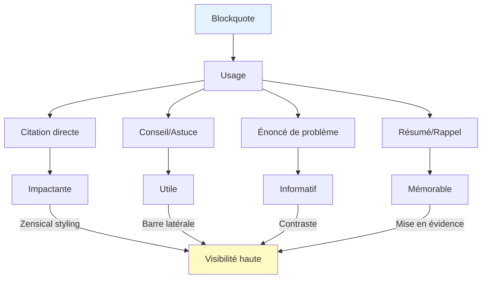
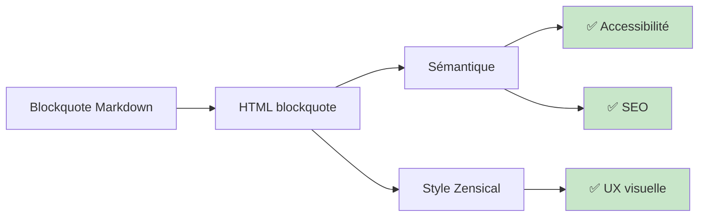

# Citations et blockquotes

## Vue d'ensemble

Les blockquotes (citations) créent un encadré visuel distinct pour:
- Citer du texte d'une source externe
- Isoler une pensée importante
- Créer des appels à l'action
- Mettre en évidence un conseil ou un avertissement

Zensical style les blockquotes de façon élégante avec une barre latérale colorée.

## Syntaxe

### Blockquote simple

Commencez une ligne par `>`:

```markdown
> Ceci est une citation.
```

Rendu:
> Ceci est une citation.

### Blockquote multi-ligne

```markdown
> Il est important de pratiquer régulièrement.
> La consistance est la clé du succès.
> Ne abandonnez pas après les premiers revers.
```

Rendu:
> Il est important de pratiquer régulièrement.
> La consistance est la clé du succès.
> Ne abandonnez pas après les premiers revers.

### Blockquote imbriquée

Ajoutez `>>` pour imbriquer:

```markdown
> Première citation
>
> > Sous-citation imbriquée
```

Rendu:
> Première citation
>
> > Sous-citation imbriquée

## Blockquote avec mise en forme

Vous pouvez utiliser la mise en forme Markdown **dans** une blockquote:

```markdown
> **Règle importante:** Toujours valider les entrées utilisateur avant de les traiter.
>
> Ignorez ce point et vous risquez:
> - Des bugs difficiles à déboguer
> - Des failles de sécurité
> - Une mauvaise expérience utilisateur
```

Rendu:
> **Règle importante:** Toujours valider les entrées utilisateur avant de les traiter.
>
> Ignorez ce point et vous risquez:
> - Des bugs difficiles à déboguer
> - Des failles de sécurité
> - Une mauvaise expérience utilisateur

## Blockquote avec attrib. source

Pour citer une source, ajoutez une ligne de crédit:

```markdown
> La perfection est l'ennemi du bien.
>
> — Voltaire
```

Rendu:
> La perfection est l'ennemi du bien.
>
> — Voltaire

## Cas d'usage détaillés

### 1. Citation d'expert

```markdown
> "Le code est lu bien plus de fois qu'il n'est écrit."
>
> — Guido van Rossum, créateur de Python
```

### 2. Conseil important

```markdown
> **💡 Conseil:** Utilisez des noms de variables descriptifs
> plutôt que des abréviations ou lettres simples.
```

### 3. Énoncé de problème

```markdown
> ❌ **Problème:** Le site s'affiche mal sur mobile
> 
> **Symptôme:** Les images débordent du conteneur
> 
> **Cause:** Width non limée avec max-width
```

### 4. Solution/résumé

```markdown
> ✅ **Solution:** Ajouter `max-width: 100%` à vos images
> pour les adapter automatiquement au conteneur.
```

## Diagramme: Hiérarchie des blockquotes



## Blockquote vs Admonitions

Quelle est la différence? Quand utiliser quoi?

| Aspect | Blockquote | Admonition |
|--------|-----------|-----------|
| **Syntaxe** | `>` | `!!! note` |
| **Style** | Barre latérale simple | Boîte avec icône, titre |
| **Types** | Tous | note, warning, danger, info, tip, etc. |
| **Interaction** | Statique | Parfois avec animation |
| **Usage** | Citation, conseil | Avertissement, note système |

!!! note "Quand utiliser blockquote"
    - Citation directe d'une source
    - Conseil délibératif ("Conseil: ...") 
    - Pensée importante mais pas critique
    - Référence à un expert

!!! warning "Quand utiliser admonition"
    - Mise en garde (⚠️ warning)
    - Information système (ℹ️ info)
    - Danger ou erreur courant (❌ danger)
    - Conseil technique important (💡 tip)

## Bloc quote vide pour espacement

Utilisez un `>` seul pour créer un espace sans contenu (pratique pour structurer):

```markdown
> Première section
>
> > Detail imbriqué
>
> Deuxième section
```

## Accessibility & Performance

Zensical rend les blockquotes avec:
- ✅ Balise HTML sémantique `<blockquote>`
- ✅ Contraste de couleur amélioré
- ✅ Lisibilité mobile preservée
- ✅ Support des lecteurs d'écran



## Exemple complet

```markdown
---
icon: lucide/quote-2
title: L'art de la citation
---

# L'art de la citation

## Pourquoi citer?

Les citations renforcent votre argument en:

> Apportant la perspective d'un expert reconnu

> Soutenant votre affirmation avec des preuves

> Créant un lien émotionnel avec le lecteur

## Citation célèbre

> "The only way to do great work is to love what you do."
>
> — Steve Jobs

## Conseil appliqué

> **💡 À retenir:** Les citations courtes (1-2 lignes) ont plus d'impact
> que les longues dissertations.

## Bon vs Mauvais exemple

### ✅ Bon

> "Simplicité est la sophistication ultime."  
> — Léonard de Vinci

### ❌ Mauvais (trop long)

> Léonard de Vinci a dit quelque chose de très sage à propos de la
> simplicité étant la forme la plus élevée de sophistication, ce qui
> signifie vraiment qu'il faut toujours chercher à simplifier plutôt
> que de compliquer...

```

