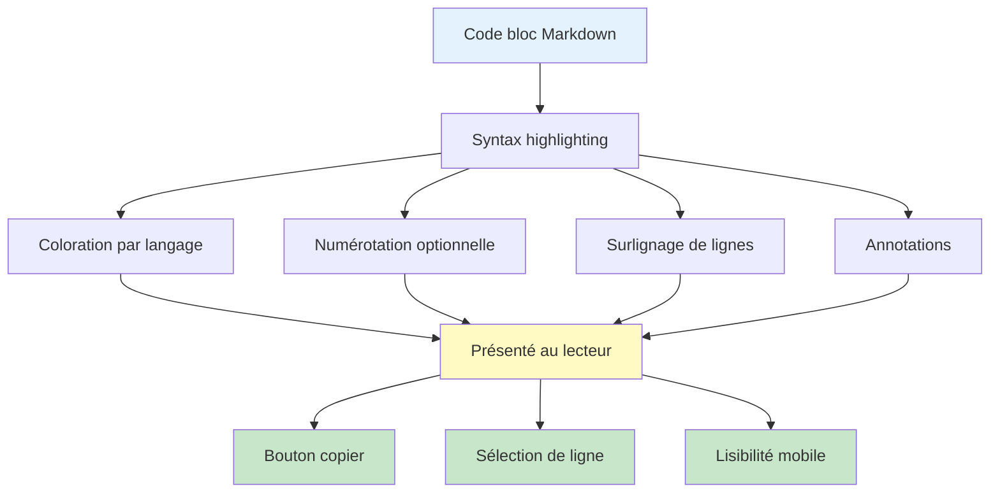

# Blocs de code et annotations

## Vue d'ensemble

Les blocs de code permettent de partager des extraits, des exemples ou des commandes. Zensical offre des fonctionnalités avancées:
- **Coloration syntaxique** (syntax highlighting) pour 100+ langages
- **Numéros de ligne** (line numbers)
- **Surlignage de lignes** (line highlighting)
- **Annotations** (code annotations avec tooltips)
- **Titre** (code block title)
- **Boutons de copie** (copy button)
- **Sélection de lignes** (line selection)

## Syntaxe basique

### Bloc de code simple

Utilisez trois backticks (`` ` ``) avec le langage:

````markdown
```python
def greet(name):
    print(f"Hello, {name}!")

greet("Alice")
```
````

Rendu:
```python
def greet(name):
    print(f"Hello, {name}!")

greet("Alice")
```

### Langages supportés

Zensical utilise Highlight.js avec support pour:

```
javascript, python, java, cpp, c, go, rust, ruby, php, sql,
html, css, json, yaml, xml, bash, shell, git, diff, markdown,
typescript, jsx, tsx, vue, svelte, liquid, nunjucks, handlebars,
docker, dockerfile, nginx, apache, makefile, cmake, gradle, maven,
et 50+ autres...
```

## Options avancées

### 1. Titre du bloc

```markdown
```python title="main.py"
def main():
    print("Hello, World!")

if __name__ == "__main__":
    main()
```

Rendu avec titre "main.py" en haut du bloc.

### 2. Numéros de ligne

```markdown
```python linenums="1"
def factorial(n):
    if n <= 1:
        return 1
    return n * factorial(n - 1)
```

Les lignes sont numérotées de 1 à N.

### 3. Surlignage de lignes

```markdown
```python hl_lines="2 4"
def add(a, b):
    result = a + b  # Ligne surlignée
    print(f"Résultat: {result}")
    return result  # Ligne surlignée
```

Les lignes 2 et 4 sont mises en évidence en jaune.

### 4. Démarrage à un numéro spécifique

```markdown
```python linenums="10"
# Commence à la ligne 10
def multiply(a, b):
    return a * b
```

### 5. Annotations (tooltips)

```markdown
```python
def greet(name):
    print(f"Hello, {name}!")  # (1)!

greet("Alice")  # (2)!
```

1. Ceci utilise une f-string pour insérer le nom
2. Appel de la fonction avec argument

Les nombres `(1)!` et `(2)!` créent des tooltips interactifs.

## Cas d'usage avancés

### 1. Code en langages multiples (Content Tabs)

```markdown
=== "Python"

    ```python
    print("Hello from Python!")
    ```

=== "JavaScript"

    ```javascript
    console.log("Hello from JavaScript!");
    ```

=== "Rust"

    ```rust
    println!("Hello from Rust!");
    ```
```

Rendu avec onglets sélectionnables.

### 2. Diff (comparaison avant/après)

```markdown
```diff
- Old approach (deprecated)
+ New approach (recommended)
  function process(data) {
-   return lodash.map(data, x => x.value)
+   return data.map(x => x.value)
  }
```

### 3. Output/Résultat

```markdown
```
$ npm run build
> Building project...
> ✅ Build successful
> Generated: /dist
```

### 4. YAML Configuration

```markdown
```yaml title="config.yml"
project:
  name: "Documentation"
  language: "en"
features:
  navigation:
    instant: true
    sections: true
```

## Diagramme: Flux de présentation du code



## Configuration Zensical

Assurez-vous d'activer les features souhaitées dans `zensical.toml`:

```toml
features = [
    "content.code.copy",        # Bouton copier
    "content.code.select",      # Sélection de ligne
    "content.code.annotate",    # Annotations (tooltips)
]
```

## Code inline vs blocs

### Code inline (backtick simple)

Pour du code court dans un paragraphe:

```markdown
Utilisez la fonction `parseInt()` pour convertir une chaîne.
Lancez `npm install` pour installer les dépendances.
```

### Code bloc (triple backtick)

Pour du code long ou complet:

```markdown
```javascript
function fibonacci(n) {
    if (n <= 1) return n;
    return fibonacci(n - 1) + fibonacci(n - 2);
}
```

| Aspect | Inline | Bloc |
|--------|--------|------|
| **Usage** | Noms de fonction, variables, commandes | Exemples complets |
| **Longueur** | 1-30 caractères | 30+ caractères |
| **Coloration** | Non | Oui (syntax highlight) |
| **Numérotation** | Non | Oui (optionnel) |

## Bonnes pratiques

### 1. Langage correct

```markdown
✅ BON
```python
x = [1, 2, 3]
print(x)
```

❌ MAUVAIS
```
x = [1, 2, 3]
print(x)
```
(pas de coloration sans langage)
```

### 2. Annotations claires et brèves

```markdown
✅ BON
```python
def count_items(items):
    return len(items)  # (1)!
```

1. Utilise la fonction built-in `len()`

❌ MAUVAIS
```python
def count_items(items):
    return len(items)  # (1)!
```

1. Cette fonction compte les éléments dans la liste en utilisant
   la fonction intégrée len() qui retourne la longueur...
```

### 3. Code court et pertinent

```markdown
✅ BON (montre le concept)
```javascript
const users = data.filter(x => x.active);
```

❌ MAUVAIS (trop long, confus)
```javascript
function processData(inputData, filterType) {
    let results = [];
    for (let i = 0; i < inputData.length; i++) {
        if (filterType === 'active') {
            if (inputData[i].active === true) {
                results.push(inputData[i]);
            }
        }
    }
    return results;
}
```
```

## Exemple complet

```markdown
---
icon: lucide/code
title: Exemples de code en Zensical
---

# Exemples de code

## Installation

```bash title="Terminal"
npm install my-package --save
```

## Configuration

```javascript title="config.js" linenums="1"
const config = {
    apiUrl: process.env.API_URL,  // (1)!
    timeout: 5000,
    retries: 3,  // (2)!
};

module.exports = config;
```

1. Charge l'URL API depuis les variables d'environnement
2. Nombre de tentatives avant d'abandonner

## Comparaison

=== "Avant"

    ```javascript
    const id = user.id;
    const name = user.name;
    const email = user.email;
    ```

=== "Après (destructuring)"

    ```javascript
    const { id, name, email } = user;
    ```
```

