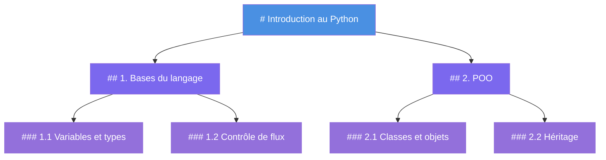
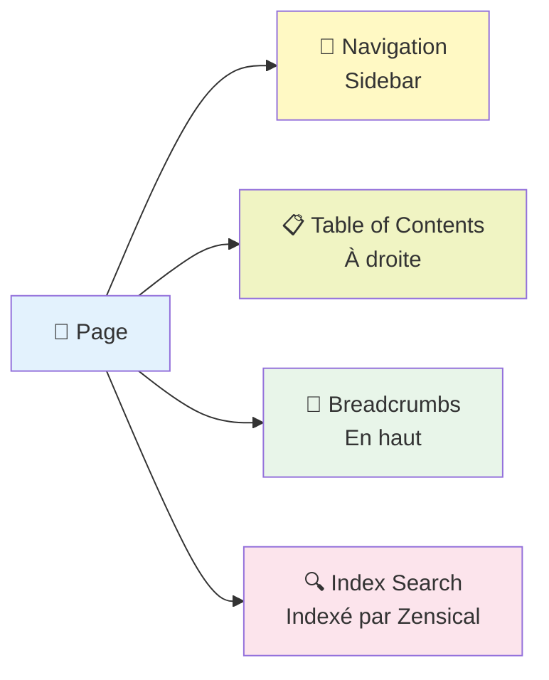

# En-têtes et structure de document

## Introduction

Les en-têtes (headings) sont la fondation de la structure de votre documentation. Ils permettent:
- **Navigabilité** : Les lecteurs trouvent rapidement les sections
- **Accessibilité** : Les lecteurs d'écran naviguent par en-têtes
- **SEO** : Moteurs de recherche utilisent les en-têtes pour indexer
- **Table des matières** : Zensical génère automatiquement une TOC (table of contents) depuis les en-têtes

## Les 6 niveaux d'en-têtes

Markdown supporte 6 niveaux (H1 à H6). Chaque page doit avoir un seul H1 (titre principal).

```markdown
# H1 — Titre principal (un seul par page)
## H2 — Section majeure
### H3 — Sous-section
#### H4 — Détail
##### H5 — Rarement utilisé
###### H6 — Très rare
```

### Exemple réel

```markdown
---
title: "Mon guide complet"
---

# Introduction au Python

## 1. Bases du langage

### 1.1 Variables et types
Contenu détaillé sur les variables...

### 1.2 Contrôle de flux
Contenu sur les boucles...

## 2. Programmation orientée objet

### 2.1 Classes et objets
...
```

## Hiérarchie visuelle

Voici comment Zensical affiche la structure des en-têtes dans la navigation:



## Bonnes pratiques

### 1. Un H1 par page
```markdown
✅ BON
# Mon guide complet
Contenu...

❌ MAUVAIS
# Premier titre
## Deuxième titre
# Troisième titre (deux H1!)
```

### 2. Pas de saut de niveau
```markdown
✅ BON
# Section
## Sous-section
### Détail

❌ MAUVAIS
# Section
#### Détail (saute H2 et H3!)
```

### 3. Noms descriptifs
```markdown
✅ CLAIR
## Installation sur Windows
## Installation sur macOS

❌ VAGUE
## Installation
## Installation
```

### 4. Cohérence dans la structure
```markdown
✅ COHÉRENT
# Chapitre 1: Bases
## 1.1 Concept A
## 1.2 Concept B

# Chapitre 2: Avancé
## 2.1 Concept C
## 2.2 Concept D
```

## Impact de la structure sur la navigation

Zensical génère automatiquement:
- **Sidebar** : Liste des pages et en-têtes (si `navigation.sections` est activé)
- **Table of Contents (TOC)** : Colonne de droite avec tous les H2, H3, etc.
- **Breadcrumbs** : Chemin de navigation (si `navigation.path` est activé)
- **Search** : Les en-têtes améliorent l'indexation search

Exemple de navigation générée:



## Cas d'usage avancés

### En-têtes avec ID personnalisé

Zensical génère automatiquement des ID depuis les en-têtes. Si vous avez besoin d'un ID spécifique, référencez par le texte:

```markdown
## Configuration avancée {#config-avancée}
```

Puis référencez:
```markdown
Voir la [configuration avancée](#config-avancée)
```

### Niveau de profondeur dans la TOC

Zensical met en retrait les en-têtes dans la table of contents selon leur niveau. Les niveaux trop profonds (H5, H6) sont généralement cachés pour la lisibilité.

## Résumé

| Aspect | Description |
|--------|-------------|
| **H1** | Un seul par page, titre principal |
| **H2-H3** | Section et sous-section (les plus utilisés) |
| **H4-H6** | Détails, rarement nécessaires |
| **Hiérarchie** | Pas de sauts de niveau (H1 → H2 → H3) |
| **Noms** | Clairs, descriptifs et uniques |
| **Navigation** | Affectent sidebar, TOC, breadcrumbs, search |

