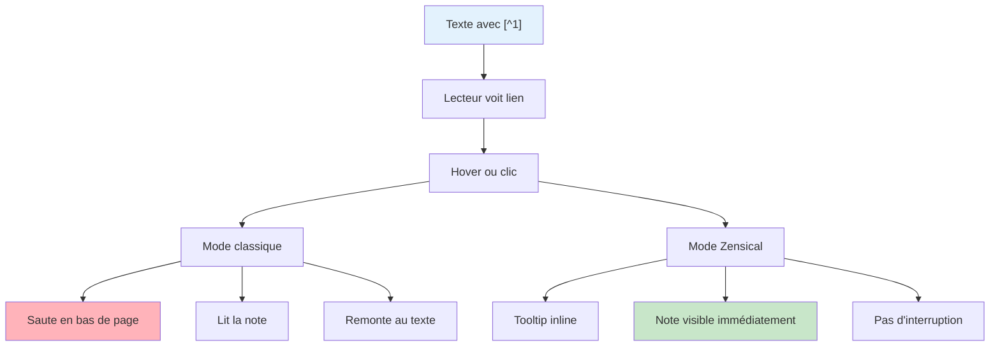

# Notes de bas de page (Footnotes)

## Vue d'ensemble

Les footnotes (notes de bas de page) permettent:
- Ajouter des références et crédits
- Expliquer des termes sans interrompre la lecture
- Citer des sources
- Fournir des détails optionnels

Zensical rend les footnotes en **tooltips inline** (si activé dans `zensical.toml`) plutôt qu'en bas de page classique.

## Syntaxe basique

### Footnote simple

Utilisez `[^1]` pour créer une référence et définissez-la:

```markdown
Ceci est un texte avec une note de bas de page.[^1]

[^1]: Ceci est le contenu de la note.
```

Rendu:
> Ceci est un texte avec une note de bas de page.[^1]

[^1]: Ceci est le contenu de la note.

### Plusieurs footnotes

```markdown
Alice[^1] et Bob[^2] ont créé ce projet.

[^1]: Alice est une ingénieure logiciel avec 10 ans d'expérience.
[^2]: Bob est un designer UX primé.
```

Rendu:
> Alice[^1] et Bob[^2] ont créé ce projet.

[^1]: Alice est une ingénieure logiciel avec 10 ans d'expérience.
[^2]: Bob est un designer UX primé.

### Footnote avec contenu long

```markdown
Voir la documentation[^docs] pour plus de détails.

[^docs]: Cette documentation couvre:
    - Installation
    - Configuration
    - Exemples d'utilisation
    - Dépannage courant
    
    Elle est mise à jour mensuellement.
```

### Footnote nommée (plus claire)

Au lieu de `[^1]`, utilisez des noms significatifs:

```markdown
Le protocole HTTPS[^https] est recommandé pour la sécurité.

[^https]: HTTPS (HyperText Transfer Protocol Secure) chiffre
    la communication entre le client et le serveur, empêchant
    les intercepteurs de lire les données.
```

## Cas d'usage détaillés

### 1. Attribution et crédits

```markdown
Cette architecture a été conçue par Jane Smith[^arch-credit]
en collaboration avec son équipe.

[^arch-credit]: Jane Smith (@janesmith), Lead Architect chez TechCorp,
    2023. Voir aussi son article: "Scaling to Millions" sur son blog.
```

### 2. Définitions de termes techniques

```markdown
L'API utilise REST[^rest] pour communiquer avec le serveur.

La base de données est normalisée[^normalization] pour éviter les redondances.

[^rest]: REST (Representational State Transfer) est un style architectural
    utilisant les verbes HTTP (GET, POST, PUT, DELETE) sur des ressources.

[^normalization]: La normalisation de base de données réduit la duplication
    de données et améliore l'intégrité. Les formes normales vont de 1NF à BCNF.
```

### 3. Références à des sources externes

```markdown
Le taux de conversion moyen est 3.2%[^conversion-stat].

[^conversion-stat]: Selon l'étude "E-commerce Benchmarks 2023"
    de Nielsen Digital. Résultats peuvent varier par industrie.
```

### 4. Notes de traducteur

```markdown
The framework supports JSX[^footnote-jsx].

[^footnote-jsx]: (Note du traducteur) JSX est une syntaxe JavaScript
    qui permet d'écrire du HTML dans du code JavaScript, popularisée
    par React.
```

### 5. Nuances et exceptions

```markdown
Python est le langage le plus populaire pour la data science[^py-caveat].

[^py-caveat]: Bien que Python soit dominant, Julia gagne en popularité
    pour certaines tâches de calcul scientifique haute performance.
```

## Diagramme: Flux de footnote en Zensical



## Configuration dans Zensical

Pour activer les tooltips footnotes, assurez-vous que dans `zensical.toml`:

```toml
features = [
    "content.footnote.tooltips",  # Affiche les footnotes en tooltip
]
```

Sans cette feature, les footnotes s'affichent classiquement en bas de page.

## Footnotes vs autres éléments

### Footnotes vs Admonitions

| Aspect | Footnote | Admonition |
|--------|----------|-----------|
| **Longueur** | Court (1-2 lignes) | Court à moyen |
| **Intrusif** | Non (caché) | Oui (visible) |
| **Style** | Tooltip discret | Boîte évidente |
| **Usage** | Détail optionnel | Avertissement/info |
| **Exemple** | Définition terme | Note d'attention |

### Footnotes vs Blockquote

```markdown
❌ MAUVAIS (utiliser blockquote pour une note)
> Note: Ceci est une information supplémentaire.

✅ BON (utiliser footnote pour détail optionnel)
Ceci est une information supplémentaire[^1].
[^1]: Détail que le lecteur peut ignorer.
```

## Bonnes pratiques

### 1. Keep footnotes court

```markdown
✅ BON (bref)
Python[^1] est populaire pour la data science.
[^1]: Langage de programmation interprété, open source.

❌ MAUVAIS (trop long)
Python[^1] est populaire pour la data science.
[^1]: Python est un langage de programmation de haut niveau
    créé en 1991 par Guido van Rossum. Il est connu pour sa
    syntaxe simple et lisible. La communauté Python est très
    active et il y a des milliers de bibliothèques disponibles...
```

Pour du contenu long, utilisez une admonition `??? info` au lieu d'une footnote.

### 2. Numéroter pour l'ordre de lecture

```markdown
✅ BON
Le projet[^1] a gagné un prix[^2] en 2023[^3].

[^1]: GitHub: github.com/project
[^2]: Prix "Innovation" de TechWorld Awards
[^3]: Année de la première victoire majeure

❌ MAUVAIS (numérotation non logique)
Le projet[^3] a gagné un prix[^1] en 2023[^2].
```

### 3. Utiliser des noms clairs

```markdown
✅ BON
Le standard HTTP[^http-ref] utilise les codes 2xx[^codes-success].

[^http-ref]: RFC 7231 - Hypertext Transfer Protocol (HTTP/1.1)
[^codes-success]: Codes 200-299 indiquent une réponse réussie

❌ MAUVAIS
Le standard HTTP[^note1] utilise les codes 2xx[^note2].

[^note1]: ...
[^note2]: ...
```

## Exemple complet

```markdown
---
icon: lucide/bookmark
title: Utiliser les footnotes
---

# Utiliser les footnotes

## Introduction

Les footnotes sont essentielles pour[^footnote-essential] une documentation
de qualité professionnelle.

[^footnote-essential]: Elles permettent de fournir des détails sans
    interrompre le flux principal du texte.

## Cas d'usage

### Attribution

Ce projet a été créé par Sarah Johnson[^sarah-bio] et son équipe.

[^sarah-bio]: Sarah Johnson (@sarahjohnson), Lead Developer,
    fondatrice de DevShop Inc. Auteure de plusieurs articles
    sur la scalabilité.

### Définitions

Nous utilisons l'architecture microservices[^microservices]
pour notre backend.

[^microservices]: Architecture où l'application est divisée en
    petits services indépendants, chacun responsable d'une
    fonction métier spécifique. Avantages: scalabilité, maintenabilité.

### Notes spéciales

La version 2.0[^v2-breaking] introduit des changements majeurs.

[^v2-breaking]: Voir le [guide de migration](migration.md) pour
    les breaking changes et comment mettre à jour votre code.

## Consignes

✅ Gardez les footnotes brèves  
✅ Utilisez pour les détails optionnels  
✅ Numérotez dans l'ordre de lecture  
❌ Ne mettez pas de contenu critique en footnote
```

