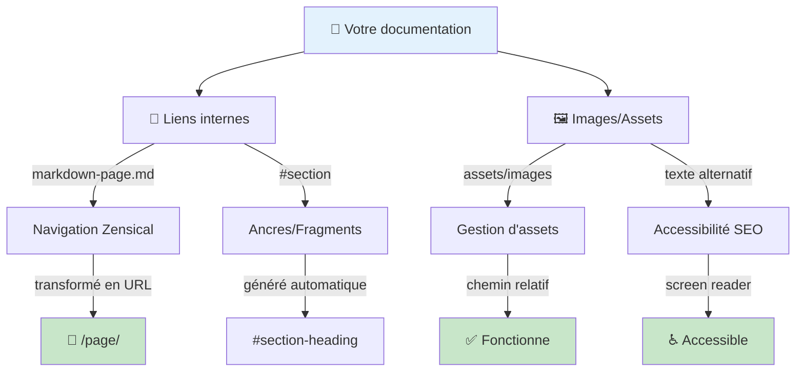
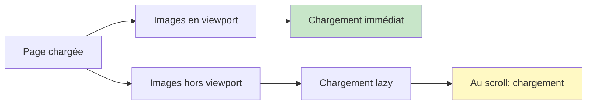

# Liens et images

## Vue d'ensemble

Les liens et images sont essentiels pour une documentation riche et navigable. Zensical traite automatiquement:
- **Liens relatifs** : Navigation interne entre pages
- **Liens externes** : Vers des ressources externes
- **Images** : Gestion des assets avec texte alternatif
- **Lazy loading** : Optimisation des performances

## Syntaxe des liens

### 1. Lien simple

```markdown
[Texte visible](https://example.com)
```

Rendu:
> [Texte visible](https://example.com)

### 2. Lien avec titre/tooltip

```markdown
[Consulter la documentation](https://zensical.org "Cliquez ici pour plus d'info")
```

### 3. Lien interne (vers autre page)

Utilisez les chemins relatifs pour la navigation interne:

```markdown
[Voir le guide sur les en-têtes](markdown-en-tetes.md)
[Retour à l'accueil](index.md)
```

!!! warning
    Zensical transforme automatiquement les `.md` en `/` pour les URLs finales.
    `markdown-en-tetes.md` devient `markdown-en-tetes/` en production.

### 4. Lien vers une section (ancre)

Référencez une section par son en-tête:

```markdown
Voir la [section sur les exposants](#syntaxe-des-images)
```

## Syntaxe des images

### 1. Image simple

```markdown

```

### 2. Image avec titre

```markdown

```

### 3. Image en lien (cliquable)

```markdown
[](https://zensical.org)
```

## Bonnes pratiques pour les images

### 1. Toujours fournir un texte alternatif

```markdown
✅ BON


❌ MAUVAIS


```

Le texte alternatif:
- Aide les malvoyants (lecteurs d'écran)
- S'affiche si l'image ne charge pas
- Améliore le SEO
- Rend votre doc plus accessible

### 2. Organiser les assets

Structure recommandée:
```
docs/
├── index.md
├── markdown-en-tetes.md
├── assets/
│   ├── images/
│   │   ├── logo.png
│   │   ├── diagram-arch.png
│   │   └── screenshot-ui.png
│   └── files/
│       └── template.zip
```

### 3. Chemins relatifs

```markdown
✅ BON (relatif)


❌ MAUVAIS (absolu, ne fonctionne pas)


❌ MAUVAIS (dépendant de la structure)

```

### 4. Taille et format

```markdown
✅ Pour web:
- PNG (images avec transparence)
- JPG (photos)
- WebP (moderne, meilleure compression)
- SVG (diagrammes, icônes)

❌ Évitez:
- BMP (trop volumineux)
- TIFF (format d'archivage)
```

## Diagramme: Flux de navigation interne



## Cas d'usage avancés

### 1. Galerie d'images

```markdown
## Galerie d'exemples


```

### 2. Images cliquables

```markdown
[](https://youtube.com/...)
```

### 3. Références de liens centralisées

Au lieu de répéter les URLs, définissez-les une fois:

```markdown
Consultez la [documentation officielle][zensical-docs] et le [code source][github].

[zensical-docs]: https://zensical.org/docs/
[github]: https://github.com/zensical/zensical
```

## Tableau récapitulatif

| Élément | Syntaxe | Exemple |
|---------|---------|---------|
| Lien simple | `[texte](url)` | `[Google](https://google.com)` |
| Lien avec titre | `[texte](url "titre")` | `[Google](https://google.com "Moteur de recherche")` |
| Lien interne | `[texte](page.md)` | `[Accueil](index.md)` |
| Ancre | `[texte](#section)` | `[Voir plus](#advanced)` |
| Image | `` | `` |
| Image cliquable | `[](lien)` | `[](home.md)` |
| Lien référencé | `[texte][ref]` + `[ref]: url` | Voir exemple ci-dessus |

## Performance: Optimisation des images

Zensical supporte le **lazy loading** automatiquement. Les images se chargent seulement quand elles entrent dans le viewport (visible sur l'écran).



## Exemple complet

```markdown
---
icon: lucide/image
title: Guide des images
---

# Guide des images


## Types d'images supportées

Voir plus de détails: [formats d'image recommandés](markdown-liens-images.md#performance-optimisation-des-images)

## Galerie


[Voir plus d'exemples](assets/examples.md)
```

