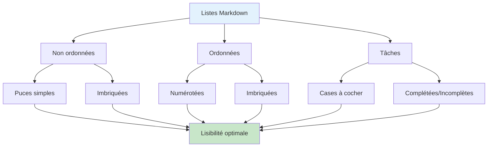
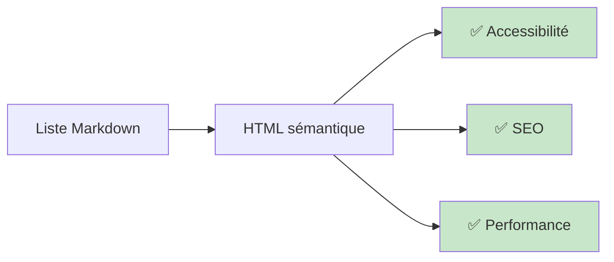

# Listes et imbrication

## Vue d'ensemble

Les listes structurent et organisent l'information. Zensical supporte:
- **Listes non ordonnées** : Points à puces (tirets, étoiles, signes plus)
- **Listes ordonnées** : Numérotées
- **Listes imbriquées** : Jusqu'à plusieurs niveaux
- **Listes de tâches** : Cases à cocher (to-do lists)
- **Listes mélangées** : Non-ordonnées + ordonnées

## Listes non ordonnées

### Syntaxe

Utilisez `-`, `*` ou `+` au début de la ligne:

```markdown
- Item 1
- Item 2
- Item 3

* Item A (identique avec *)
* Item B

+ Item X (identique avec +)
+ Item Y
```

Rendu:
- Item 1
- Item 2
- Item 3

### Bonnes pratiques

Restez cohérent — utilisez le même symbole (`-` recommandé):

```markdown
✅ BON
- Concept A
- Concept B
- Concept C

❌ MAUVAIS (mélange les symboles)
- Concept A
* Concept B
+ Concept C
```

## Listes ordonnées

### Syntaxe

Commencez par `1.` (ou tout chiffre, Markdown normalise):

```markdown
1. Première étape
2. Deuxième étape
3. Troisième étape
```

Rendu:
1. Première étape
2. Deuxième étape
3. Troisième étape

### Numérotation automatique

```markdown
✅ BON: Markdown normalise automatiquement
1. Étape un
1. Étape deux
1. Étape trois

Rendu:
1. Étape un
2. Étape deux
3. Étape trois
```

## Imbrication (listes imbriquées)

Indentez avec **2 espaces** pour imbriquer:

### Exemple simple

```markdown
1. Installation
   - Télécharger
   - Configurer
   - Valider
2. Utilisation
   - Démarrage
   - Configuration
3. Dépannage
```

Rendu:
1. Installation
   - Télécharger
   - Configurer
   - Valider
2. Utilisation
   - Démarrage
   - Configuration
3. Dépannage

### Imbrication profonde

```markdown
- Catégorie A
  - Sous-catégorie A1
    - Détail A1a
    - Détail A1b
  - Sous-catégorie A2
- Catégorie B
  - Sous-catégorie B1
```

Rendu:
- Catégorie A
  - Sous-catégorie A1
    - Détail A1a
    - Détail A1b
  - Sous-catégorie A2
- Catégorie B
  - Sous-catégorie B1

!!! warning "Imbrication au-delà de 3 niveaux"
    Au-delà de 3-4 niveaux d'imbrication, la lisibilité diminue.
    Préférez scinder en plusieurs sections ou pages.

## Listes de tâches (Task lists)

Utilisez `- [ ]` pour une tâche incomplète, `- [x]` pour complétée:

```markdown
- [x] Tâche complétée
- [ ] Tâche en attente
- [ ] Tâche à faire
```

Rendu (le style dépend de Zensical):
- [x] Tâche complétée
- [ ] Tâche en attente
- [ ] Tâche à faire

### Cas d'usage

Parfait pour:
- **Checklists de déploiement** — Étapes à valider avant production
- **Requis/Optionnel** — Indiquer ce qui est fait vs reste à faire
- **Dépannage** — Points de vérification

```markdown
## Checklist avant déploiement

- [x] Tests unitaires passent
- [x] Tests d'intégration OK
- [ ] Revue de code approuvée
- [ ] Performance validée
- [ ] Documentation à jour
```

## Diagramme: Hiérarchie des listes



## Cas d'usage avancés

### 1. Listes avec descriptions longues

```markdown
- **Configuration globale**
  Paramètres qui affectent tout le système. À configurer avant
  de démarrer l'application pour la première fois.

- **Configuration locale**
  Paramètres spécifiques à votre environnement. À revoir après
  chaque migration ou mise à jour majeure.
```

### 2. Mélanger listes et paragraphes

Pour ajouter un paragraphe dans une liste, indentez de 2 espaces:

```markdown
1. Installer les dépendances

   ```bash
   npm install
   ```

2. Configurer l'app

   Voir la section [Configuration](#configuration) pour plus de détails.

3. Lancer le serveur
```

### 3. Listes avec code

```markdown
- **JavaScript** : Utilisez `const` plutôt que `var`
  ```javascript
  const name = "Alice";
  const age = 30;
  ```

- **Python** : Utilisez des f-strings
  ```python
  name = "Bob"
  print(f"Bonjour {name}")
  ```
```

## Tableau récapitulatif

| Type | Symbole | Usage | Exemple |
|------|---------|-------|---------|
| Non-ordonnée | `-` ou `*` ou `+` | Énumération simple | Ingrédients, conseils |
| Ordonnée | `1.` `2.` `3.` | Ordre important | Étapes, tutoriel |
| Imbriquée | Indentation 2 espaces | Hiérarchie | Catégories/détails |
| Tâches | `- [ ]` `- [x]` | Suivi d'avancement | Checklist, requis |

## Performance et accessibilité

Zensical rend les listes de façon **sémantiquement correcte** (balises HTML `<ul>`, `<ol>`, `<li>`), ce qui:
- ✅ Améliore la lisibilité pour les lecteurs d'écran
- ✅ Aide le SEO (structure claire)
- ✅ Rend le contenu scrapable par les bots



## Exemple complet

```markdown
---
icon: lucide/list
title: Planifier votre projet
---

# Planifier votre projet

## Étapes de base

1. Définir les objectifs
   - Clarté du produit
   - Valeur pour l'utilisateur
   
2. Rechercher la cible
   - Qui sont les utilisateurs?
   - Quels sont leurs besoins?

3. Concevoir la solution
   - Croquis initial
   - Prototypage rapide

## Checklist de validation

- [ ] Objectifs définis
- [ ] Cible identifiée
- [ ] Solution conçue
- [ ] Ressources allouées
- [ ] Calendrier défini

## Bonnes pratiques

- Maintenir les listes courtes (5-7 items max)
- Utiliser des verbes pour les listes de tâches
- Grouper les items liés
- Éviter l'imbrication profonde (max 3-4 niveaux)
```

