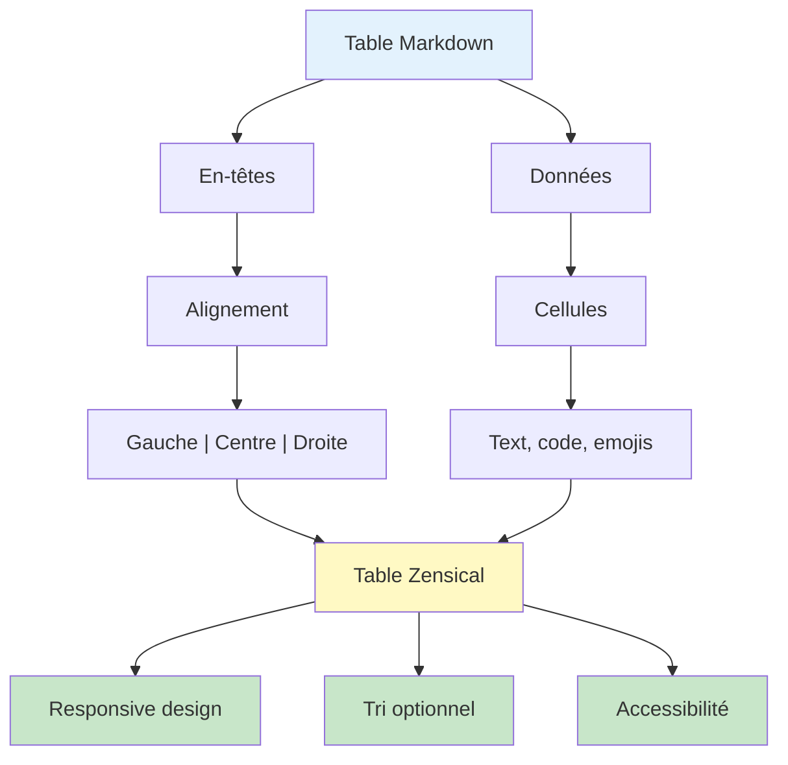
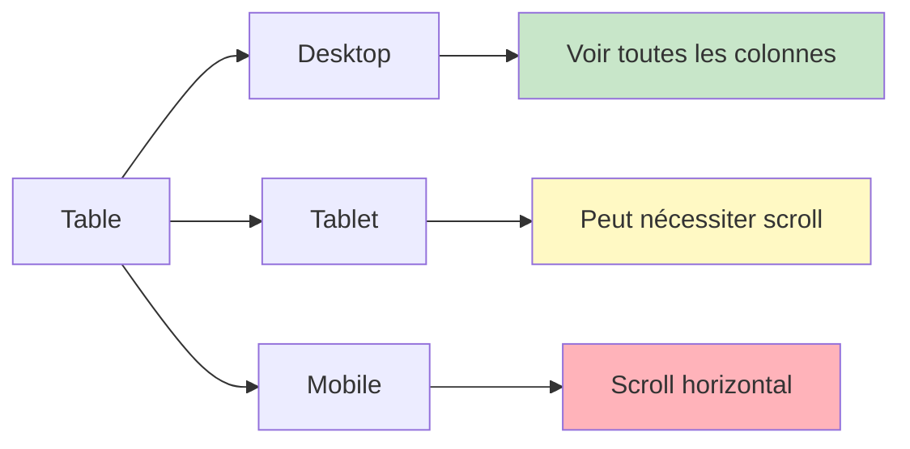

# Tables et données tabulaires

## Vue d'ensemble

Les tables Markdown permettent de présenter des données structurées et comparatives. Zensical supporte:
- **Tables standard** (pipes et tirets)
- **Alignement** (gauche, centre, droite)
- **Tri** (optionnel dans Zensical avec feature enabled)
- **Responsive** (adapté aux petits écrans)

## Syntaxe basique

### Table simple

```markdown
| En-tête 1 | En-tête 2 | En-tête 3 |
|-----------|-----------|-----------|
| Cellule 1 | Cellule 2 | Cellule 3 |
| Cellule 4 | Cellule 5 | Cellule 6 |
```

Rendu:
| En-tête 1 | En-tête 2 | En-tête 3 |
| --------- | --------- | --------- |
| Cellule 1 | Cellule 2 | Cellule 3 |
| Cellule 4 | Cellule 5 | Cellule 6 |

### Alignement des colonnes

Utilisez `:` pour contrôler l'alignement:

```markdown
| Gauche | Centre | Droite |
|:-------|:------:|-------:|
| A      |   B    |      C |
| 1      |   2    |      3 |
```

Rendu:
| Gauche | Centre | Droite |
|:-------|:------:|-------:|
| A      |   B    |      C |
| 1      |   2    |      3 |

!!! note "Alignement"
    - `:---` = Aligné à gauche (défaut)
    - `:--:` = Centré
    - `---:` = Aligné à droite (pour chiffres)

## Cas d'usage avancés

### 1. Comparaison de produits

```markdown
| Fonctionnalité | Plan Basique | Plan Pro | Plan Enterprise |
|:---------------|:----------:|:-------:|----------------:|
| Utilisateurs | 1 | Illimité | Illimité |
| Stockage | 5 GB | 100 GB | 1 TB |
| Support | Email | Chat 24/7 | Dédié |
| Prix/mois | $9 | $29 | Contact |
```

Rendu:
| Fonctionnalité | Plan Basique | Plan Pro | Plan Enterprise |
|:---------------|:----------:|:-------:|----------------:|
| Utilisateurs | 1 | Illimité | Illimité |
| Stockage | 5 GB | 100 GB | 1 TB |
| Support | Email | Chat 24/7 | Dédié |
| Prix/mois | $9 | $29 | Contact |

### 2. Tableau de compatibilité

```markdown
| Navigateur | HTML5 | CSS3 | ES6 |
|:-----------|:-----:|:----:|:---:|
| Chrome | ✅ | ✅ | ✅ |
| Firefox | ✅ | ✅ | ✅ |
| Safari | ⚠️ | ✅ | ⚠️ |
| IE11 | ❌ | ⚠️ | ❌ |
```

Rendu:
| Navigateur | HTML5 | CSS3 | ES6 |
|:-----------|:-----:|:----:|:---:|
| Chrome | ✅ | ✅ | ✅ |
| Firefox | ✅ | ✅ | ✅ |
| Safari | ⚠️ | ✅ | ⚠️ |
| IE11 | ❌ | ⚠️ | ❌ |

### 3. Tableau de référence API

```markdown
| Méthode | Endpoint | Description | Code de retour |
|---------|----------|-------------|---------------:|
| GET | `/api/users` | Lister tous les utilisateurs | 200 |
| POST | `/api/users` | Créer un nouvel utilisateur | 201 |
| GET | `/api/users/{id}` | Récupérer un utilisateur | 200 |
| PUT | `/api/users/{id}` | Mettre à jour un utilisateur | 200 |
| DELETE | `/api/users/{id}` | Supprimer un utilisateur | 204 |
```

Rendu:
| Méthode | Endpoint | Description | Code de retour |
|---------|----------|-------------|---------------:|
| GET | `/api/users` | Lister tous les utilisateurs | 200 |
| POST | `/api/users` | Créer un nouvel utilisateur | 201 |
| GET | `/api/users/{id}` | Récupérer un utilisateur | 200 |
| PUT | `/api/users/{id}` | Mettre à jour un utilisateur | 200 |
| DELETE | `/api/users/{id}` | Supprimer un utilisateur | 204 |

### 4. Calendrier/Horaire

```markdown
| Jour | Matin | Après-midi | Soir |
|------|:-----:|:----------:|:----:|
| Lundi | Réunion | Développement | Pause |
| Mardi | Code | Code | Revue |
| Mercredi | Code | Réunion | Code |
| Jeudi | Test | Déploiement | Docs |
| Vendredi | Sprint Planning | Retro | Libre |
```

### 5. Table avec mise en forme

Vous pouvez utiliser Markdown à l'intérieur des cellules:

```markdown
| Langage | Syntaxe | Cas d'usage |
|---------|---------|------------|
| **Python** | `if x > 0:` | Data science, backend |
| **JavaScript** | `if (x > 0) {}` | Web frontend, Node.js |
| **SQL** | `WHERE x > 0` | Databases, queries |
```

Rendu:
| Langage | Syntaxe | Cas d'usage |
|---------|---------|------------|
| **Python** | `if x > 0:` | Data science, backend |
| **JavaScript** | `if (x > 0) {}` | Web frontend, Node.js |
| **SQL** | `WHERE x > 0` | Databases, queries |

## Diagramme: Flux de présentation des tables



## Bonnes pratiques

### 1. Largeur des colonnes

Équilibrez la largeur — pas plus de 5-6 colonnes:

```markdown
✅ BON (3-4 colonnes)
| Outil | Version | Support |
|------|---------|---------|
| Node | 18.x | ✅ |

❌ MAUVAIS (trop de colonnes)
| Outil | Version | Status | Author | License | Downloads | Stars | Updated |
|------|---------|--------|--------|---------|-----------|-------|---------|
| ... | ... | ... | ... | ... | ... | ... | ... |
```

### 2. En-têtes clairs et courts

```markdown
✅ BON
| Langage | Syntaxe | Usage |
|---------|---------|-------|
| Python | `def func():` | Data |

❌ MAUVAIS
| Programming Language | Syntax Example | Primary Use Case |
|---|---|---|
| Python | `def func():` | Data science and machine learning |
```

### 3. Alignement approprié

```markdown
✅ BON
| Texte | Nombre | Pourcentage |
|:------|--------:|-----------:|
| Nom | 1500 | 85% |
| Item | 2000 | 95% |

❌ MAUVAIS (nombre aligné à gauche)
| Texte | Nombre |
|:------|:-------|
| Nom | 1500 |
| Item | 2000 |
```

### 4. Contenu court par cellule

```markdown
✅ BON (concis)
| Étape | Description |
|------|------------|
| 1 | Installer |
| 2 | Configurer |
| 3 | Déployer |

❌ MAUVAIS (trop de texte)
| Étape | Description |
|------|------------|
| 1 | Installer les dépendances depuis npm en exécutant la commande npm install et en attendant que tout se termine |
| 2 | ... |
```

## Tables vs Listes

Quand utiliser une table vs une liste?

| Aspect | Table | Liste |
|--------|-------|-------|
| **Données** | Structurées, colonnes | Énumération |
| **Comparaison** | ✅ Bien | ❌ Difficile |
| **Mobile** | ⚠️ Peut être difficile | ✅ Bien |
| **Longueur** | 3-6 colonnes max | Illimité |
| **Exemple** | Pricing, API, specs | Étapes, checklist |

## Responsivité mobile

Zensical rend les tables responsives:
- Sur petit écran: défilement horizontal
- Alternance de couleurs pour lisibilité
- Contraste amélioré



## Exemple complet

```markdown
---
icon: lucide/table-2
title: Tableau de référence complet
---

# Tableau de référence

## Comparaison de plans

| Fonction | Gratuit | Pro | Enterprise |
|:---------|:-------:|:---:|----------:|
| Utilisateurs | 1 | 10 | Illimité |
| Projets | 1 | 5 | Illimité |
| Support | Forum | Email | Téléphone |
| SLA | Aucun | 99% | 99.9% |
| Prix | Gratuit | $29/mois | Contact |

## État des services

| Service | Status | Uptime | Incidents |
|---------|:------:|-------:|----------:|
| API | ✅ | 99.98% | 0 |
| Web | ✅ | 99.99% | 0 |
| Database | ✅ | 99.95% | 1 |
| Cache | ✅ | 99.99% | 0 |
```

