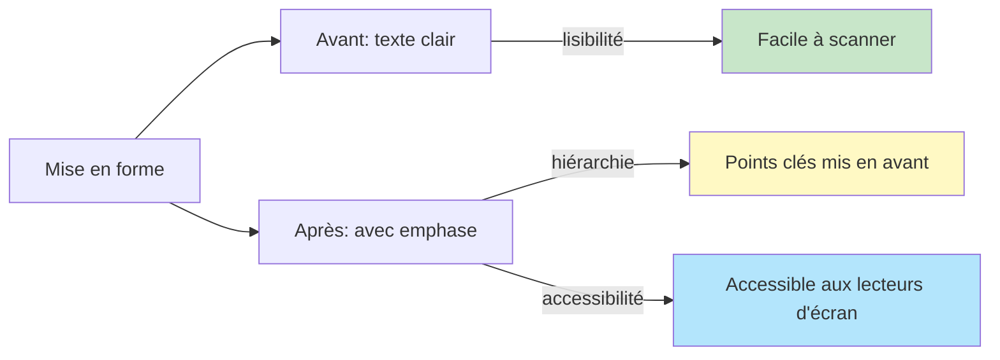

# Mise en forme du texte

## Vue d'ensemble

La mise en forme du texte permet de mettre en évidence, souligner ou structurer le contenu. Zensical supporte:
- **Gras** : `**texte**` → met l'accent principal
- **Italique** : `*texte*` → suggestion, références
- **Barré** : `~~texte~~` → texte supprimé ou obsolète
- **Code inline** : `` `code` `` → noms de variables, commandes
- **Exposants/Indices** : `A^n^`, `H~2~O` → formules chimiques, mathématiques
- **Surbrillance** : `==texte==` → mise en évidence visuelle (Zensical)
- **Soulignement** : `^^texte^^` → insertion/modification (Zensical)

## Syntaxe détaillée

### 1. Gras (`**texte**`)

Utilisez pour:
- Les termes importants
- Les points clés d'un paragraphe
- Les noms de produits/outils

```markdown
**Zensical** est un générateur de documentation.
La **performance** est critique pour une bonne UX.
```

Rendu:
> **Zensical** est un générateur de documentation.
> La **performance** est critique pour une bonne UX.

### 2. Italique (`*texte*`)

Utilisez pour:
- Les références (livres, films, auteurs)
- Les termes étrangers
- Les suggestions douces

```markdown
Voir le livre *Clean Code* de Robert C. Martin.
C'est un concept appelé *memoization* en informatique.
```

Rendu:
> Voir le livre *Clean Code* de Robert C. Martin.
> C'est un concept appelé *memoization* en informatique.

### 3. Gras + Italique (`***texte***`)

Pour insister fortement:

```markdown
C'est ***très important*** de tester votre code.
```

Rendu:
> C'est ***très important*** de tester votre code.

### 4. Barré (`~~texte~~`)

Utilisez pour:
- Montrer une approche obsolète
- Rayer une idée sans la supprimer
- Historique/changelog

```markdown
L'approche ~~callback hell~~ a été remplacée par les Promises.
```

Rendu:
> L'approche ~~callback hell~~ a été remplacée par les Promises.

### 5. Code inline (`` `code` ``)

Utilisez pour:
- Noms de variables
- Commandes shell
- Noms de fichiers
- Références à du code

```markdown
Utilisez la fonction `parseInt()` pour convertir une chaîne en nombre.
Le fichier `config.json` contient les paramètres.
Lancez `npm install` pour installer les dépendances.
```

### 6. Exposants (`A^T^A`) et Indices (`H~2~O`)

Pour les formules chimiques, mathématiques:

```markdown
La formule chimique de l'eau est H~2~O.
L'équation est: x^2^ + y^2^ = r^2^
Formule de calcul d'intérêt: A = P(1 + r/n)^nt^
```

Rendu avec Zensical:
> La formule chimique de l'eau est H~2~O.
> L'équation est: x^2^ + y^2^ = r^2^

### 7. Surbrillance (`==texte==`) — Zensical

Mise en évidence visuelle (surlignage jaune généralement):

```markdown
C'est la ==partie la plus importante== du guide.
```

### 8. Soulignement (`^^texte^^`) — Zensical

Pour montrer du texte inséré ou modifié:

```markdown
^^Nouvelle fonctionnalité~~ ajoutée en v2.0.
```

## Combinaisons

Vous pouvez combiner plusieurs styles:

```markdown
***Attention:*** la fonction `setTimeout()` est **asynchrone**.
La ==formule== **x^2^ + y^2^ = r^2^** est **importante**.
```

## Diagramme de hiérarchie visuelle

Zensical crée une hiérarchie visuelle en fonction de votre emphase:


## Cas d'usage avancés: Semantic Emphasis

Pour une **bonne accessibilité**, ne mélangez pas les sens:

```markdown
❌ MAUVAIS: Utiliser la couleur seule
"Le texte rouge doit être ignoré"

✅ BON: Combiner texte et style
"**IMPORTANT**: Le texte **doit** être ignoré"
```

## Tableau récapitulatif

| Syntaxe | Résultat | Utilisé pour |
|---------|----------|--------------|
| `**texte**` | **texte** | Point clé, terme important |
| `*texte*` | *texte* | Référence, suggestion |
| `***texte***` | ***texte*** | Insistance forte |
| `~~texte~~` | ~~texte~~ | Obsolète, supprimé |
| `` `code` `` | `code` | Identifiant, commande |
| `H~2~O` | H~2~O | Indice (chimie, maths) |
| `A^n^` | A^n^ | Exposant (maths, formule) |
| `==texte==` | ==texte== | Surlignage (Zensical) |
| `^^texte^^` | ^^texte^^ | Soulignement (Zensical) |

## Bonnes pratiques de lisibilité

1. **Pas d'abus de mise en forme** — Limite à 1-2 styles par phrase
2. **Cohérence** — Toujours la même mise en forme pour le même concept
3. **Accessibilité** — Ne pas utiliser JUSTE la couleur/emphase, ajouter du contexte
4. **Lisibilité mobile** — Trop de styles rend difficile la lecture sur petit écran



